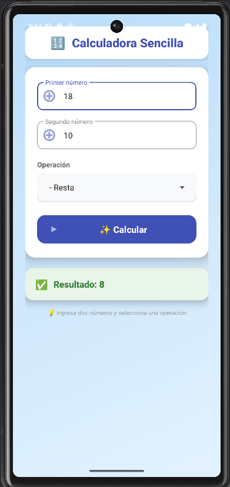
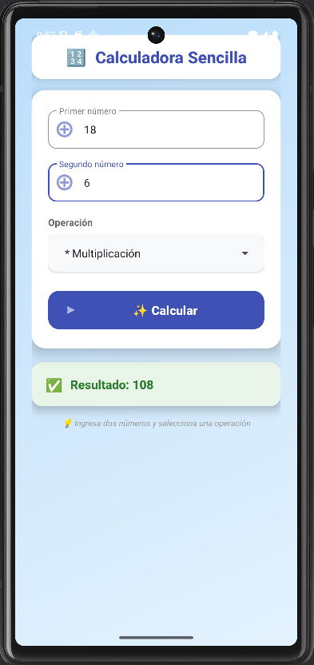
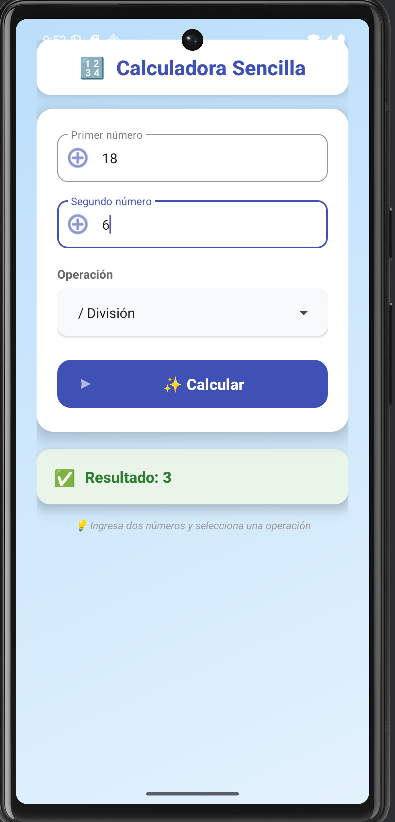

# **Calculadora MVVM - Arquitectura Moderna**

Aplicación Android de calculadora básica que demuestra la implementación de arquitectura MVVM (Model-View-ViewModel) con LiveData y Data Binding para un desarrollo Android moderno y escalable.

## **📱 Descripción**

Esta aplicación implementa una calculadora completa siguiendo las mejores prácticas de Android con:
* Arquitectura MVVM (Model-View-ViewModel) para separación de responsabilidades
* LiveData para comunicación reactiva entre componentes
* Data Binding para eliminación de findViewById()
* ViewModel para manejo de estado y lógica de negocio
* Material Design para una interfaz moderna y atractiva

## **🚀 Características**

* **Arquitectura MVVM**: Separación clara entre Vista, ViewModel y Modelo
* **LiveData**: Comunicación reactiva y lifecycle-aware
* **Data Binding**: Binding automático entre UI y datos
* **ViewModel**: Persistencia de datos durante cambios de configuración
* **Material Design**: Interfaz moderna con Cards, gradientes y animaciones
* **Operaciones básicas**: Suma, resta, multiplicación y división
* **Validación de entrada**: Manejo de errores y división por cero
* **Diseño responsivo**: Layout optimizado para diferentes tamaños de pantalla

## **📋 Requisitos**

* Android Studio Giraffe o superior
* SDK mínimo: API 21 (Android 5.0)
* SDK objetivo: API 34 (Android 14)
* Kotlin 1.9.0
* View Binding habilitado
* Material Design Components

## **💻 Uso**

### **Operaciones Básicas**
1. **Ingresar números**: Completa los campos "Primer número" y "Segundo número"
2. **Seleccionar operación**: Elige entre Suma, Resta, Multiplicación o División
3. **Calcular**: Presiona el botón "✨ Calcular" para obtener el resultado

**SUMA**


**RESTA**



**MULTIPLICACIÓN**



**DIVISIÓN**


4. **Ver resultado**: El resultado aparece automáticamente en la tarjeta verde

### **Características Avanzadas**
* **Validación automática**: La app detecta entradas inválidas
* **Manejo de errores**: División por cero muestra mensaje de error
* **Formato inteligente**: Números enteros se muestran sin decimales
* **Persistencia de estado**: Los datos se mantienen al rotar la pantalla

## **📂 Estructura del Proyecto**

```
calculadoras12/
├── app/
│   └── src/
│       └── main/
│           ├── java/com/example/calculadoras12/
│           │   ├── MainActivity.kt
│           │   └── CalculatorViewModel.kt
│           ├── res/
│           │   ├── layout/
│           │   │   └── activity_main.xml
│           │   ├── drawable/
│           │   │   └── gradient_background.xml
│           │   ├── values/
│           │   │   ├── colors.xml
│           │   │   ├── strings.xml
│           │   │   └── themes.xml
│           │   └── mipmap/
│           └── AndroidManifest.xml
├── gradle/
└── README.md
```

## **🎯 Funcionalidades Implementadas**

### **1. Arquitectura MVVM**
```kotlin
// ViewModel maneja la lógica de negocio
class CalculatorViewModel : ViewModel() {
    private val _result = MutableLiveData<Double>()
    val result: LiveData<Double> get() = _result
    
    fun calculate(operation: String, num1: Double, num2: Double) {
        _result.value = when {
            operation.contains("+") -> num1 + num2
            operation.contains("-") -> num1 - num2
            operation.contains("*") -> num1 * num2
            operation.contains("/") -> if (num2 != 0.0) num1 / num2 else Double.NaN
            else -> 0.0
        }
    }
}
```

### **2. LiveData y Observer Pattern**
```kotlin
// MainActivity observa cambios en el resultado
viewModel.result.observe(this, Observer { result ->
    binding.textViewResult.text = if (result.isNaN()) {
        "Error: División por cero"
    } else {
        "Resultado: ${if (result % 1.0 == 0.0) result.toInt() else result}"
    }
})
```

### **3. Data Binding**
```kotlin
// Eliminación de findViewById con Data Binding
private lateinit var binding: ActivityMainBinding
binding = ActivityMainBinding.inflate(layoutInflater)
setContentView(binding.root)
```

### **4. Material Design UI**
- **Cards con elevación**: Organización visual clara
- **Gradientes**: Fondo atractivo y moderno
- **TextInputLayout**: Campos de entrada Material Design
- **MaterialButton**: Botones con estilo Material
- **Iconos y emojis**: Elementos visuales intuitivos

## **🔧 Componentes Técnicos**

### **Arquitectura MVVM**
```
┌─────────────────┐    ┌──────────────────┐    ┌─────────────────┐
│   View (UI)     │    │    ViewModel     │    │     Model       │
│  MainActivity   │◄──►│ CalculatorViewModel│◄──►│  (Logic/Data)   │
│  activity_main  │    │                  │    │                 │
└─────────────────┘    └──────────────────┘    └─────────────────┘
```

### **Flujo de Datos**
1. **Usuario** interactúa con la UI (MainActivity)
2. **MainActivity** llama métodos del ViewModel
3. **ViewModel** procesa la lógica y actualiza LiveData
4. **LiveData** notifica a los observadores
5. **UI** se actualiza automáticamente

## **🎨 Diseño UI**

### **Paleta de Colores**
- **Primary**: #3F51B5 (Indigo)
- **Background**: Gradiente azul suave
- **Success**: #4CAF50 (Verde)
- **Error**: #F44336 (Rojo)
- **Surface**: #FFFFFF (Blanco)

### **Componentes Visuales**
- **Header Card**: Título con icono
- **Calculator Card**: Formulario principal
- **Result Card**: Resultado con feedback visual
- **Floating Action**: Botón principal destacado

## **🚀 Beneficios de la Arquitectura**

### **Separación de Responsabilidades**
- **View**: Solo maneja la UI y eventos de usuario
- **ViewModel**: Contiene la lógica de negocio y estado
- **Model**: Representa los datos y operaciones

### **Testabilidad**
- **ViewModel** puede testearse independientemente
- **LiveData** facilita testing con observadores
- **Lógica separada** de la UI permite unit testing

### **Mantenibilidad**
- **Código organizado** por responsabilidades
- **Fácil modificación** de UI sin afectar lógica
- **Escalable** para nuevas funcionalidades

### **Ciclo de Vida**
- **ViewModel** sobrevive a cambios de configuración
- **LiveData** es lifecycle-aware
- **No memory leaks** por gestión automática

## **📱 Capturas de Pantalla**

La aplicación presenta:
- Interfaz moderna con Material Design
- Cards con sombras y elevación
- Gradientes suaves y colores vibrantes
- Feedback visual inmediato
- Diseño responsivo para diferentes pantallas

## **🔧 Configuración del Proyecto**

### **build.gradle (Module: app)**
```gradle
android {
    viewBinding {
        enabled = true
    }
}

dependencies {
    implementation 'androidx.lifecycle:lifecycle-viewmodel-ktx:2.6.2'
    implementation 'androidx.lifecycle:lifecycle-livedata-ktx:2.6.2'
    implementation 'androidx.activity:activity-ktx:1.7.2'
    implementation 'com.google.android.material:material:1.9.0'
}
```

## **🎯 Próximas Mejoras**

- [ ] Historial de operaciones
- [ ] Más operaciones matemáticas
- [ ] Modo científico
- [ ] Temas personalizables
- [ ] Exportar resultados
- [ ] Accesibilidad mejorada

---

**Desarrollado con ❤️ usando Android MVVM Architecture**